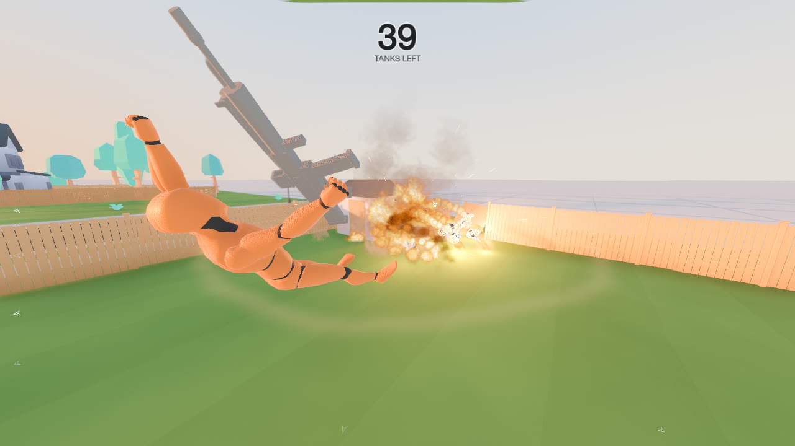
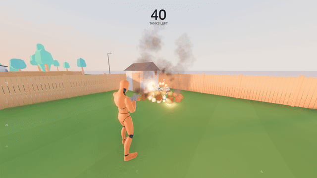

# Propane

A third-person sandbox. Run around a procedurally generated suburb floating in a white void, find the propane tanks,
stacked in groups around the yards, and shoot them. The first shot punctures a tank and it vents fire forever, pushed around by its own jet. The
second shot blows it up, throwing cars, bins, fence panels and you. Clear every tank and a new suburb assembles
around you. There is no health and no score.



Multiplayer is **tank bank**, a free-for-all for 2–5 players: every tank you blow up is banked as a point, and getting
shot (or thrown by a blast) spills your tanks back out for anyone to take. Most banked when the clock runs out wins.

See [DESIGN.md](DESIGN.md) for the design and the decisions behind it, and [MULTIPLAYER.md](MULTIPLAYER.md) for
multiplayer.

## Download and play

Builds for macOS (Apple Silicon) and Linux (x86_64) are on the
[latest release](https://github.com/talmage89/propane-game/releases/latest).

- **macOS:** unzip and open `Propane.app`. It is not notarized by Apple, so the first launch is blocked: open
  System Settings > Privacy & Security and click **Open Anyway**. Downloading with
  `gh release download --repo talmage89/propane-game` skips the prompt.
- **Linux:** extract the archive and run `./Propane.x86_64`. Needs a GPU with Vulkan drivers.

Nothing else is needed: each build carries its own .NET runtime.



## Running from source

Requires Godot 4.7.2 (.NET edition) and the .NET 10 SDK.

- Editor: open `project.godot` and press Play (F5).
- Command line: `/Applications/Godot_mono.app/Contents/MacOS/Godot --path .`

The game opens maximized on the main menu: Single player, Multiplayer or Quit. In play it captures the mouse; click
the window to recapture it after switching away.

## Multiplayer

Choose Multiplayer, type your name and the server's address (`host` or `host:port`, UDP port 24680 by default), then
create a lobby or join one. Everyone picks a name and colour in the lobby, and whoever created it sets the match
length and starts. **Host on this computer** runs a server inside your game instead; the lobby then shows the
addresses friends can use. Builds must match: the server turns away a different version.

To play against bots, create a lobby and run `tools/dev/add_bots.sh` (from source; `-x` stops them).
Starting the game with `-- --connect=host[:port]` skips straight to that server's lobbies. On macOS, the first time
you host, allow incoming connections if the system asks.

The dedicated server is the same game run headless: `./Propane.x86_64 --headless -- --server [--port=24680]`.
`tools/server/deploy.sh` exports it and runs it in Docker on a remote machine (by default an ssh host named `server`);
see [MULTIPLAYER.md](MULTIPLAYER.md) for hosting and reaching it. A downloaded build only joins a server built from the
same commit, so deploy the server from the commit the release was built from. Games run from source can join any
server with the same version.

## Controls

| Input | Action |
| --- | --- |
| W A S D | Move |
| Shift | Sprint |
| Space | Jump |
| Mouse | Look |
| Left click | Fire (hold for full auto; toggle it in the tuning panel) |
| Right click (hold) | Aim: rifle to the shoulder and a tight spread. The camera does not move. |
| R | New suburb (single player); reload (multiplayer) |
| Esc | Pause and show the controls (a match keeps running) |
| F1 or ` | Tuning panel (live sliders; in a match, debug builds only, and it changes everyone's values) |
| F11 or Alt+Enter | Fullscreen |

## Tuning

Every gameplay and effect dial is a property of `src/Core/Tuning.cs`. Press F1 in game for live sliders. Run from
the editor, **Save** writes them to `res://tuning.tres`, which the game loads on start and which the Godot inspector
can edit. In a downloaded build, Save writes the player's own `tuning.tres` in the game's data folder
(`~/Library/Application Support/Godot/app_userdata/Propane` on macOS, `~/.local/share/godot/app_userdata/Propane`
on Linux), which then takes precedence. **Defaults** restores the values in code. `FixedSeed` (World group) replays one suburb; 0 picks a random one.

## Layout

| Path | Contents |
| --- | --- |
| `src/Main.cs` | The root: the menus over their backdrop, then single player, a match, or the multiplayer server. |
| `src/Game.cs` | Single player: the void, player, HUD, menus, and the suburb swap with its dissolve and materialise. |
| `src/Net` | Multiplayer: the server, the client connection, the match world, body sync, ammo pickups. |
| `src/Core` | Tuning, input map, physics and render layers, shared assets, events, spawn roots. |
| `src/World` | The void environment, the model catalog, and the suburb builder. `Plan/` holds the pure-data generator. |
| `src/Tank` | Propane tanks, the vent jet, blasts, debris and breakaway fence panels. |
| `src/Player` | Character controller, camera, animation, the procedural rifle rig, ragdoll and get-up. |
| `src/Fx` | Explosions, tracers, impacts, hitstop, particle helpers, and the shader warm-up. |
| `src/UI` | HUD, menus (main, multiplayer, lobby, pause, match, results), match HUD, tuning panel. |
| `src/Dev`, `scenes/dev` | Test harnesses (below). |
| `shaders` | World, tank, ground, void and effect shaders, plus the shared reveal transition. |
| `tools/blender` | Scripts that build the assets in `assets/`. |
| `tools/release`, `.github/workflows` | Export templates, the release build, and the CI job that publishes it. |
| `tools/server` | The multiplayer server's Docker setup and deploy script. |
| `tools/dev` | Multiplayer test runs with bot players, and a comparison of what each bot saw. |
| `docs` | README images. |

## Dev harnesses

Each scene in `scenes/dev` is a scripted test. Arguments after `--` are read by `src/Dev/DevArgs.cs`;
`--capture-dir=<dir>` saves screenshots, and `--tune.<Name>=<value>` overrides any tuning value.

```sh
GODOT=/Applications/Godot_mono.app/Contents/MacOS/Godot

# Generator: determinism, overlaps, tank count and placement, spawn safety, reachability, and the same for match
# suburbs with player starts, ammo spots and the plan's encoding. Exits 1 on failure.
$GODOT --headless res://scenes/dev/generator_tests.tscn -- --seeds=200

# The real game with a scripted player. Scenarios: loop (default), clear (destroys every tank), ragdoll, shoot,
# tour (camera in tight spots), spots (visits each tank), settle (props that move on their own), dissolve, menus,
# readme (a chain reaction captured as frames for the README GIF; seed 23 is the one in docs/).
$GODOT --fixed-fps 60 --resolution 1280x720 res://scenes/dev/game_test.tscn -- --capture-dir=/tmp/g --scenario=ragdoll

# Soak: punctures every tank, then detonates them all at once, and reports frame times. Run without --fixed-fps.
$GODOT res://scenes/dev/soak.tscn

# Tank close-ups (scenarios: full, vent, blast, look), the character and rifle rig, the world kit, map overviews.
$GODOT --fixed-fps 60 res://scenes/dev/tank_range.tscn -- --capture-dir=/tmp/t --scenario=blast
$GODOT --fixed-fps 60 res://scenes/dev/player_range.tscn -- --capture-dir=/tmp/p
$GODOT --fixed-fps 60 res://scenes/dev/world_lab.tscn -- --capture-dir=/tmp/w
$GODOT --fixed-fps 60 res://scenes/dev/suburb_preview.tscn -- --capture-dir=/tmp/s

# Every menu screen, a solo match, and single player and back.
$GODOT res://scenes/dev/menu_test.tscn -- --capture-dir=/tmp/m

# Multiplayer: a local server and bot players under simulated lag and loss, then compare what each bot saw.
GODOT=$GODOT tools/dev/net_bots.sh -n 3 -l 60 -o /tmp/n -- --net-lag=120 --net-jitter=30 --net-loss=3
tools/dev/compare_tanks.py /tmp/n/bot*.log
```

`net_test.tscn` scenarios: bots playing (default), `duel` (hits, drops and a thrown player, filmed from both sides)
and `pickup` (an ammo can taken and returning). [MULTIPLAYER.md](MULTIPLAYER.md) lists the commands.

## Releases

Every push to `main` runs `.github/workflows/release.yml` on a Linux runner: it runs the generator tests, exports
both builds, and publishes them as the GitHub release for `config/version` in `project.godot`. Pushing again without
changing the version replaces that release's builds, so bump the version to keep the previous one. Day-to-day work
happens on `dev`.

The same build runs locally:

```sh
tools/release/install_templates.sh 4.7.2   # once: the .NET export templates, with an Apple Silicon only macOS binary
RCODESIGN=/path/to/rcodesign tools/release/build.sh   # writes build/dist/*.zip and *.tar.gz
```

Godot's built-in ad-hoc signing writes entitlement data that current macOS rejects (the app is killed at launch),
so the preset exports unsigned and [rcodesign](https://github.com/indygreg/apple-platform-rs) signs the app ad hoc.
It runs on Linux, which keeps CI off the more expensive macOS runners.

## Assets

The tank, its debris and the fireball flipbook come from the propane-tank Blender project; the other models are
CC0 kits (see [CREDITS.md](CREDITS.md)). The scripts in `tools/blender` rebuild them with Blender 5.1:

| Script | Builds |
| --- | --- |
| `export_tank.py` | `assets/tank/tank.glb` and `debris.glb` (with convex hulls) from the tank project's Unreal export |
| `build_character.py` | `assets/character/mannequin.glb`: the Quaternius mannequin with animations from both libraries |
| `build_rifle.py` | `assets/rifle/rifle.glb`, with hand, muzzle, butt and eye sockets |
| `build_props.py` | `assets/props/*.glb`: fences, grill, bins, mailbox, lamp, hydrant, patio heater and more |

Each script's header gives its exact command line.
